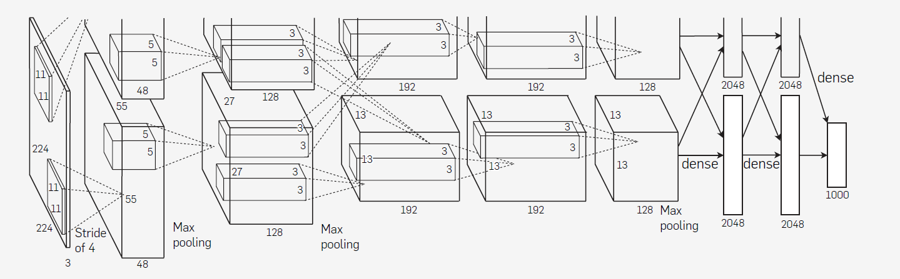

# AlexNet:ImageNet Classification with Deep Convolutional Neural Networks
## 简介
本文发表于2014年，同样是在ImageNet比赛上进行的实验的，并且获得了该比赛的冠军，该比赛将120W照片分为1000个列别，尽管与语义分割不同，但是还是有参考价值的，而且该片文章发表时间比FCN晚。

## 结构

AlexNet结构

---

如图所示，为AlexNet结构的结构，分为上下两个部分，其实上下两个部分是完全一样的，分开来是因为作者将其放在两个GPU上进行训练，并声称这样可以提高效率，但其实可能是因为GPU不够。。。，该结构共有8层神经网络，前5层为卷积神经网络，后面的为全连接层，输出为1000个类别并使用softmax的全连接层，第2，4，5层卷积层在同一个GPU上仅连接到他们的前一层，第3层的卷积核链接到第二层的所有卷积核特征图，全连接上的神经网络就全部连接到它前一层上，这也很好理解，全连接层嘛。

第一个卷积层输入为224x224x3,96个滤波器，11x11x3的卷积核，步长为4个像素，这里的卷积核感觉核平时3x3大小差距有点大。
第二个卷积层输入为第一个卷积层的输出，256个滤波器，卷积核大小为5x5x48，
第三层有384个滤波器，3x3x256卷积核大小，输入为第二层的normalized和pooled层
第四层有384个滤波器，卷积核大小为3x3x192
第五层有256个滤波器，卷积核大小为3x3x192
剩下的就是全连接层了，每个全连接层有4096个神经元

共有60M参数

### 数据增强
数据增强是最简单的减小过拟合的方法。

本文中数据增强有：
随机224x224剪裁，水平翻转，这增加了数据集的大小
对像素值进行PCA

### 其他
采用了Dropout