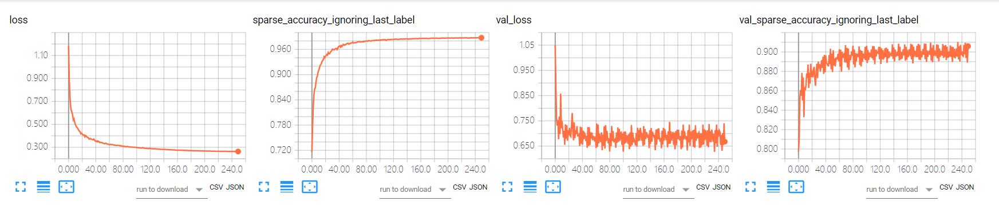

# github项目中FCN实验笔记

# 实验项目
https://github.com/aurora95/Keras-FCN

# 实验环境
Ubuntu14.04
cuda8.0
tensorflow-gpu1.4.1
keras2.0.8

keras和tensorflow版本有点低，故在gitclone之后需要对原版本进行修改一部分，特别是数据预处理的那部分，需要手动修改Iterator类。
# 实验次数及过程
修改Iterator类，使代码能够适应keras2.0.8版本，然后将数据集修改为VOC2012数据集，原代码使用的不仅仅有VOC2012，还有VOC2012扩展数据集，这里先对VOC2012数据集进行实验，在得出基本的结果再进行其他的实验。
1. 和原代码一样，不使用验证集进行训练，不使用预训练权重文件，然后在评估文件中将targetsize改为320，320，在预测之前使用cv2.resize来改变测试集图像的大小，最后得到mIoU为0.12，结果自然惨不忍睹。
2. 将验证集也加入到训练中去，在评估文件中将targetsize改为512，512，去除cv2.resize函数，不足512的部分使用np.lib.pad填充为0，然后进行预测评估，最后得到mIoU为0.22，预测效果同样很差。
3. 使用ResNet5的预训练权重来训练数据集，加入验证集，并将验证集作为测试集来评估，最后得到meanIOU: 0.516261，pixel acc: 0.874890，以下为训练过程中的的损失和精度
   
对比没有使用与训练权重的实验，发现预训练参数非常重要，原作者在该项目中最好的mIoU为0.661076，像素精度大约为0.9.
**预处理过程：**
- 使用PIL导入image和label图像，然后通过img_to_array转换为数组，其中image的shape为(309,500,3),大小为0.0-255.0，保留1位小数，- label的shape为(309,500,1),值为整数，大小在[0,255]之间，这里要注意，有可能值的大小只在0-20之间，255表示的是白色轮廓
- 然后再对要转换成target_size判断是否需要填充，并且使用np.lib.pad进行填充，这里填充的是固定值，对于image来说填充0，对于label来说填充的为label_cval，默认值是255(这里有点疑问，我认为这里应该填充为0，因为0代表背景黑色，255代表分割边界白色)，该图像由于被分割为(320,320)，所以要在高度上进行填充11行。
- 此时x.shape为(320, 500, 3)，y.shape为(320, 500, 1)，对其进行随机变换，然后对x进行标准化
- 然后对ignore_label进行处理,将255变为类别值，也就是说将255赋值为21，这样label中的像素值即为0-21，共22个类别
- 最后将其送入到batch_x,batch_y，注意此时x最大值还是255.0，归一化并没有起作用
- 将整个batch处理好之后，再来对batch_x进行处理，这里的处理是将RGB转换为BGR，然后再来Zero-center by mean pixel，但是这里用的是imagenet的平均像素