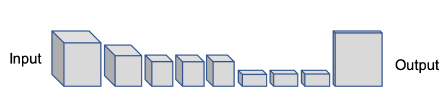
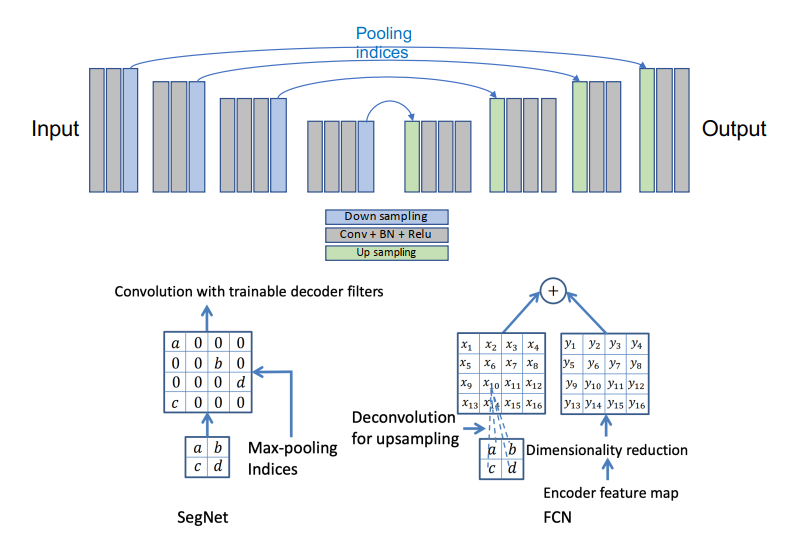
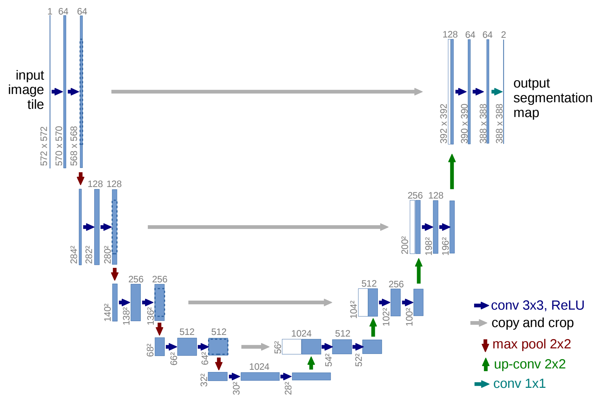
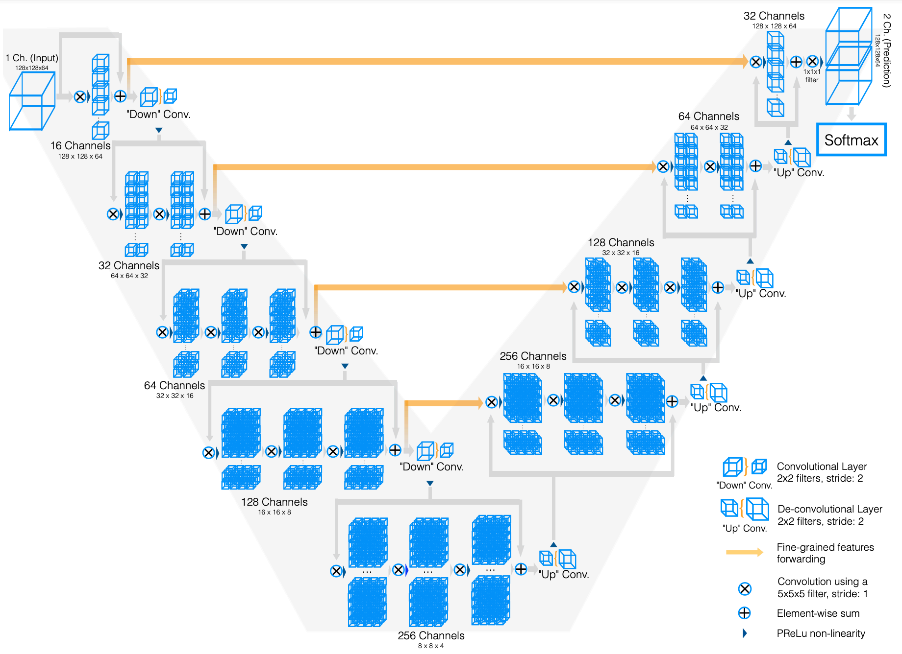
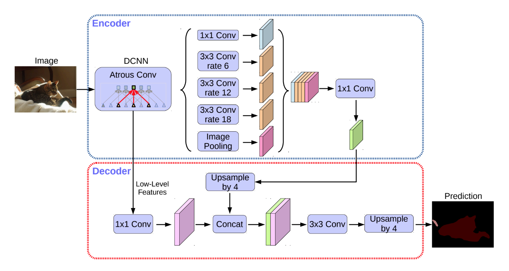
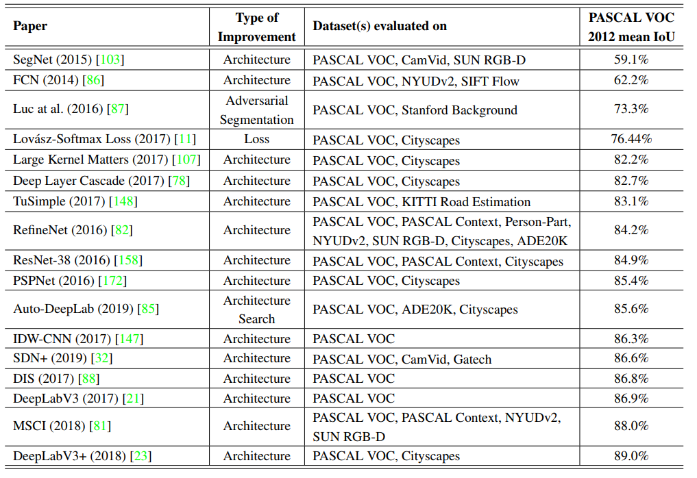

- [语义分割论文笔记](#%e8%af%ad%e4%b9%89%e5%88%86%e5%89%b2%e8%ae%ba%e6%96%87%e7%ac%94%e8%ae%b0)
- [Deep Semantic Segmentation of Natural and Medical Images: A Review](#deep-semantic-segmentation-of-natural-and-medical-images-a-review)
    - [FCN](#fcn)
  - [Encoder-decoder编码解码网络](#encoder-decoder%e7%bc%96%e7%a0%81%e8%a7%a3%e7%a0%81%e7%bd%91%e7%bb%9c)
    - [SegNet](#segnet)
    - [Unet](#unet)
    - [V-net](#v-net)
    - [DenseNet](#densenet)
    - [DeepLabV3+](#deeplabv3)
  - [减少语义分割的计算量的工作](#%e5%87%8f%e5%b0%91%e8%af%ad%e4%b9%89%e5%88%86%e5%89%b2%e7%9a%84%e8%ae%a1%e7%ae%97%e9%87%8f%e7%9a%84%e5%b7%a5%e4%bd%9c)
  - [基于注意力机制的图像语义分割](#%e5%9f%ba%e4%ba%8e%e6%b3%a8%e6%84%8f%e5%8a%9b%e6%9c%ba%e5%88%b6%e7%9a%84%e5%9b%be%e5%83%8f%e8%af%ad%e4%b9%89%e5%88%86%e5%89%b2)
  - [对抗图像语义分割](#%e5%af%b9%e6%8a%97%e5%9b%be%e5%83%8f%e8%af%ad%e4%b9%89%e5%88%86%e5%89%b2)
- [医疗图像中的架构提升](#%e5%8c%bb%e7%96%97%e5%9b%be%e5%83%8f%e4%b8%ad%e7%9a%84%e6%9e%b6%e6%9e%84%e6%8f%90%e5%8d%87)
  - [基于模型压缩的图像分割](#%e5%9f%ba%e4%ba%8e%e6%a8%a1%e5%9e%8b%e5%8e%8b%e7%bc%a9%e7%9a%84%e5%9b%be%e5%83%8f%e5%88%86%e5%89%b2)
  - [基于图像分割的对抗训练](#%e5%9f%ba%e4%ba%8e%e5%9b%be%e5%83%8f%e5%88%86%e5%89%b2%e7%9a%84%e5%af%b9%e6%8a%97%e8%ae%ad%e7%bb%83)
  - [基于RNN的网络模型](#%e5%9f%ba%e4%ba%8ernn%e7%9a%84%e7%bd%91%e7%bb%9c%e6%a8%a1%e5%9e%8b)
  - [优化方法上的提升](#%e4%bc%98%e5%8c%96%e6%96%b9%e6%b3%95%e4%b8%8a%e7%9a%84%e6%8f%90%e5%8d%87)
  - [基于重叠度量的损失函数](#%e5%9f%ba%e4%ba%8e%e9%87%8d%e5%8f%a0%e5%ba%a6%e9%87%8f%e7%9a%84%e6%8d%9f%e5%a4%b1%e5%87%bd%e6%95%b0)
- [总结](#%e6%80%bb%e7%bb%93)
# 语义分割论文笔记
# Deep Semantic Segmentation of Natural and Medical Images: A Review

一篇自然和医学图像的深度学习语义分割综述，分为6个方向:深度学习框架、基于数据综合、基于损失函数、基于序列模型、弱监督、多任务方法。

### FCN
 第一个基于CNN的方法,实现像素级别的分类，2015年Long等人发表。
    
 FCN结构 

## Encoder-decoder编码解码网络
### SegNet
2015年提出。解码器网络是为了映射低分辨率编码器特征到完整的输入分辨率特征图，从而进行像素级分类，创新性是上采样过程中使用了池化索引(pooling indices),如图：
    
 SegNet中的池化索引 

### Unet
Ronneberger等人2015年提出,典型的编码解码网络,一条编码路径和解码路径结合，加入了跨层连接。
    
 Unet结构 

### V-net
Milletari等人2016年提出，加入残差连接，将2D操作替换为3D操作，实现3D分割，并广泛使用语义分割指标：**Dice**

    
 Vnet网络结构 

### DenseNet
Jeugo等人2017年提出，使用了编码解码框架

### DeepLabV3+
2018年，state of the art 在VOC2012上。在deeplabV3的基础加入空洞卷积,编码部分通过收集不同尺度的空洞卷积和金字塔池化加入了多尺度语义信息
    
 DeeplabV3+ 

## 减少语义分割的计算量的工作
略。。。

## 基于注意力机制的图像语义分割
加入注意力机制的深度残差网络（Residual attention network for image classification，2017年）  
将注意力机制加入到空间和通道中。（Dual attention network for scene segmentation，2019年）  
金子塔注意力机制（Pyramid attention network for semantic segmentation， 2018年）  
将注意力机制加入deeplab中（Attention to scale: Scale-aware semantic image segmentation，2016年）

## 对抗图像语义分割
GANs(generative adversarial networks)

# 医疗图像中的架构提升
主要是基于深度学习的2D和体积的图像分割

## 基于模型压缩的图像分割
为了实时分割或者解决体积或2D图像，例如CT MRI和一些病理学图像。

利用神经结构搜索方法在Unet中获得更小的网络为器官和肿瘤分割（NAS-Unet: Neural architecture search for medical image segmentation，2019年）  
群体化规范（group normalizaztion，2018年）和leakyReLU函数重新设计了Unet结构使得在分割3D医学图像更加高效。（A partially reversible U-Net for memory-efficient volumetric image segmentation， 2019年）  
空洞卷积结合残差网络需要参数更少（Spinal cord gray matter segmentation using deep dilated convolutions，2018年）  
加入注意力机制的模型分割MRI图像
加入多级注意力结构分割MRI图像（Multi-scale guided attention for medical image segmentation,2019)

## 基于图像分割的对抗训练
基于对抗训练的CT图像 (PAN:Projective adversarial network for medical image segmentation，2019)
将生成对抗训练用于视网膜图像(Retinal vessel segmentation in fundoscopic images with generative adversarial networks, 2017)
基于生成对抗网络的FCN分割MRI图像(SegAN: Adversarial network with multi-scale L1 loss for medical image segmentation, 2018)

## 基于RNN的网络模型
RNN被设计用来处理序列关系,长短期记忆(LSTM是一个RNN的一种类型)

结合RNN的FCN的图像序列分割算法(Recurrent neural networks for aortic image sequence segmentation with sparse annotations, 2018)  
结合LSTM和CNN分割4D脑部MRI切片图像(Fully convolutional structured LSTM networks for joint 4D medical image segmentation, 2018)
结合LSTM和Unet分割3D CT扫描图像(Pancreas segmentation via
spatial context based U-Net and bidirectional LSTM. 2019)

## 优化方法上的提升
最常用的就是交叉熵
加权交叉熵
平衡交叉熵(Holistically-nested edge detection, 2015)
加入距离的平衡交叉熵交叉熵(Unet论文,2015)

## 基于重叠度量的损失函数
Dice loss/F1 Score
IoU 交并比
Tversky Loss(TL)

指数对数损失

Lovasz-Softmax loss
Boundary Loss 边界损失

# 总结  
VOC2012分割精度总结
    
 VOC2012分割精度总结   

其他潜在的方向：
结合先验知识，加强模型对像素的理解。
创建大型2D,3D训练集
探索类似强化学习的方法,模仿人类进行划分界限.
修改输入而不是模型,损失函数等等.