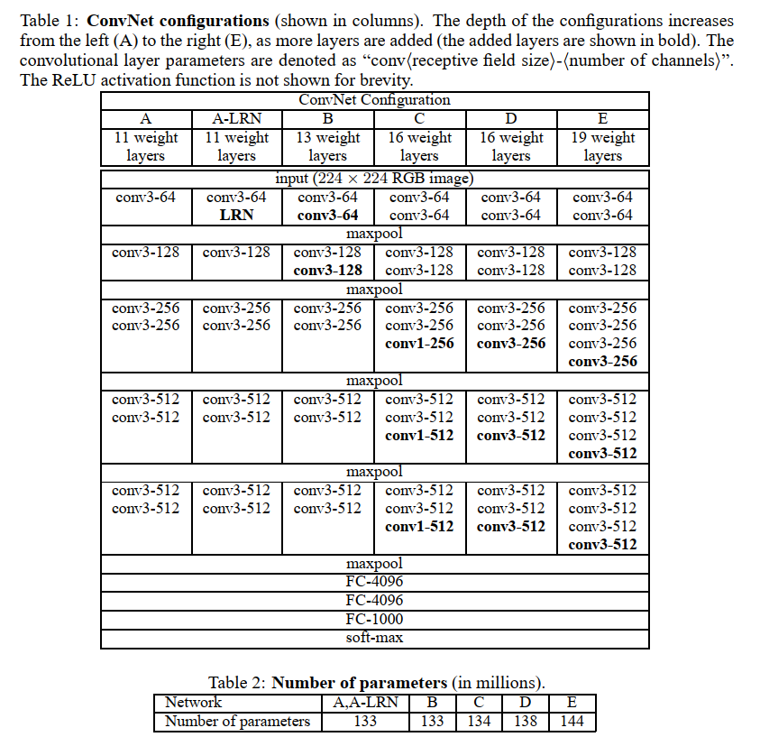

- [语义分割模型笔记](#%e8%af%ad%e4%b9%89%e5%88%86%e5%89%b2%e6%a8%a1%e5%9e%8b%e7%ac%94%e8%ae%b0)
  - [vgg16(very deep convolutional networks for large-scale image recognition)](#vgg16very-deep-convolutional-networks-for-large-scale-image-recognition)

# 语义分割模型笔记

## vgg16(very deep convolutional networks for large-scale image recognition)

一篇图像识别的开山之作,vgg 网络,摘要就说达到了他们的方法达到了 state-of-the-art...但是其实后面还有很多算法出现了.
这篇文章中设置了很多 3x3 卷积来代替 7x7 的卷积,许多参数设置都被后来的文章或者实验所应用,例如 l2 惩罚系数设置为$5*10^{-4}$,dropout 设置为 0.5,验证集精度不再提高时学习率减少 10 倍等等,都是来自于这篇文章.

除此之外,这篇文章还对图像进行预处理,包括处理成固定大小的 224x224,随机垂直翻转和随机 RGB 色彩偏移.

vgg 网络结构如下图所示

---

---

其中有 A,B,C,D,E 共 5 种网络,分别为 vgg11,vgg13,vgg16,vgg19,其中数字代表着网络层数.每种网络不论层数有多少,都有 5 个模块,然后连接最后 3 层全连接层,最后经过 softmax 层输出,每个模块经过若干次卷积之后,通过最大池化进入下一个模块.

[相关笔记 1](http://deanhan.com/2018/07/26/vgg16/)
